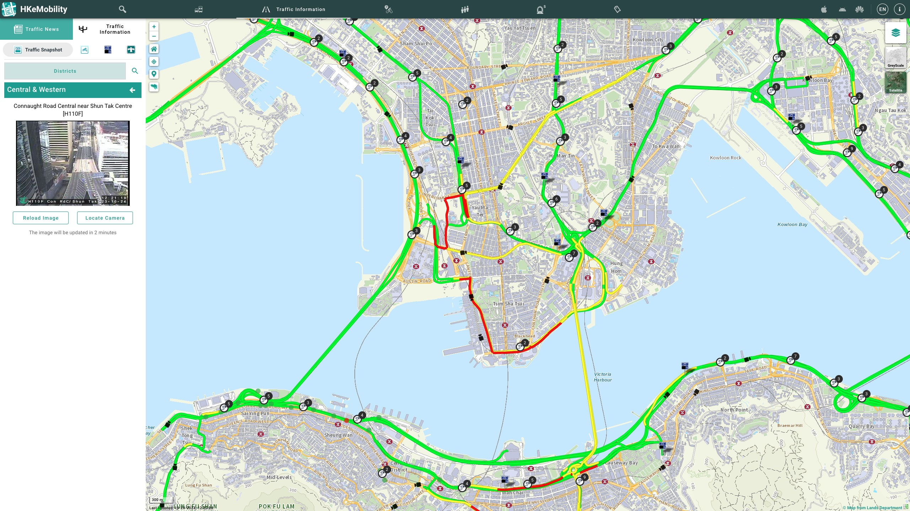

# MoCo-TimeSeries


## Description

Time series representation from a contrastive self-supervised learning perspective. MoCo-based time series representation - a case study of traffic detectors anomaly detection.

- [Medium Blog: Time series representation from a contrastive self-supervised learning perspective](https://medium.com/@yixinwong1998/time-series-representation-from-a-contrastive-self-supervised-learning-perspective-00e4c7790cf0)
- **Code**: The `main_**.py` is the main script to run the experiment with different algorithms. The `utils.py` contains some utility functions, such as base models, data loader, etc. Note that the files of `main_OmniScale.py`, `main_Rocket.py`, `main_TST.py`, `main_TCN.py` are used for time series classification for comparison. Thanks to [tsai](https://github.com/timeseriesAI/tsai), some of the above models are called from the library easily.

- **Data**: here I just provide a preprocessed dataset for quick experiment. The original dataset can be found [data.gov.hk](https://data.gov.hk/en-data/dataset/hk-td-sm_4-traffic-data-strategic-major-roads). Of course, you need to do some preprocessing with your task requirement or use your own dataset.

  

  - More detailed information can be publicly accessed from [HKeMobility](https://www.hkemobility.gov.hk/en/traffic-information/live/cctv).

  

Cited as:

```bib
@article{wang2024mocots,
  title   = "Time series representation from a contrastive self-supervised learning perspective",
  author  = "Wang, Yixin",
  journal = "Medium",
  year    = "2024",
  month   = "Oct",
  url     = "https://medium.com/@yixinwong1998/time-series-representation-from-a-contrastive-self-supervised-learning-perspective-00e4c7790cf0",
}
```
